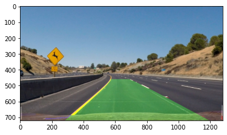

# Advanced Lane Detection

This [Article](https://advt3.com/posts/advanced_lane_detection/) gives and overview of the project.

The goals of this project are the following:

* Compute the camera calibration matrix and distortion coefficients given a set of chessboard images.
* Apply a distortion correction to raw images.
* Use color transforms, gradients, etc., to create a threshold binary image.
* Apply a perspective transform to rectify binary image ("birds-eye view").
* Detect lane pixels and fit to find the lane boundary.
* Determine the curvature of the lane and vehicle position with respect to center.
* Warp the detected lane boundaries back onto the original image.
* Output visual display of the lane boundaries and numerical estimation of lane curvature and vehicle position.

You can find a thorough description here on the [detail description](detail_description.md).

## Environment
The environment was created using [miniconda](https://docs.conda.io/en/latest/miniconda.html),
 using the following configurations, [environment.yml](environment.yml).
 
### Libraries
The libraries used on this project are:
  - numpy
  - matplotlib
  - opencv
  - jupyter

 ### References
 https://github.com/udacity/CarND-Advanced-Lane-Lines
 
 ## License
 MIT License Copyright (c) 2016-2018 Udacity, Inc.
