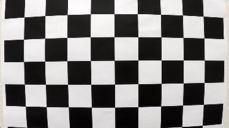
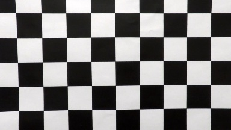
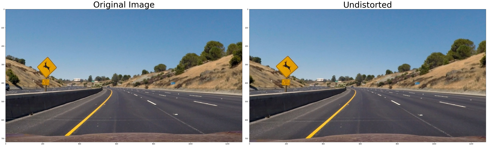
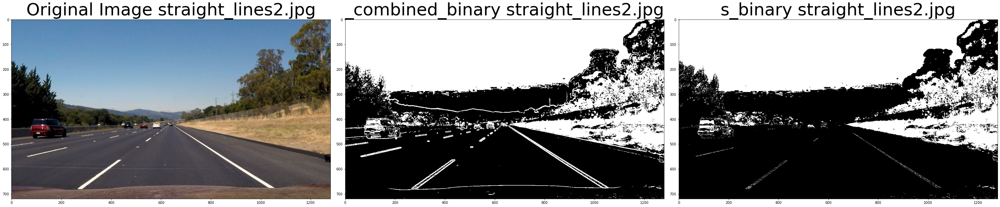
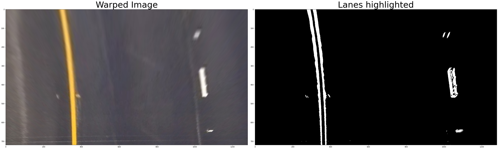
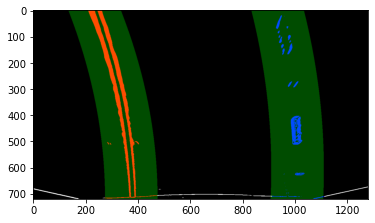
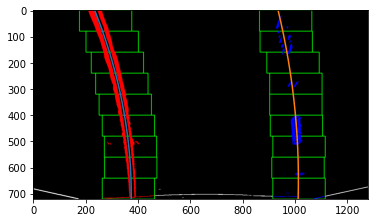

# Advanced Lane Finding Project Report

This report is divided into four(4) sections, 1) Camera Calibration, 2) Pipeline for a single image,
 3) How the pipeline works on a video and 4) Conclusions and future work.

## Camera Calibration
The purpose of the camera calibration is to reduce the distortion of the images created by the cameras. 

The class [utilities.calibration.CameraCalibration](utilities/calibration.py) allows the calibration, serialization, deserialization, and to undistort images. The calibration method receives a path parameter that contains the images, and a boolean parameter to write the image results for visual inspection.

The calibration calculates the 3D object and 2D image points on the chessboard images. For each calibration image corners are found using `cv2.findChessboardCorners`. If the corners are found by this method, both the object and image points are store. If enable the images are stored with the corners and points drawn on the images for visual inspection. 

It is also possible to serialize object and image points into a file, so this calibration step does not have to be executed every time.
The undistort method allows us to distort an image and return the camera matrix, and distortion coefficients, required for further calls to the undistort method of OpenCV.

The result can be seen in the following two images:

### Original image



### Undistort image



## Pipeline (single images)
The single image pipeline can be found as a [Jupyter notebook Pipeline](Pipeline.ipynb). The purpose is to describe the steps done to find and draw the lanes.

### Distortion-corrected image.
The first step is to have the camera correction points calculated and persisted before needed.
 After loading the points the image is undistorted by using the *undistort_image* method from *utilities.calibration.camera calibration* class.



### Thresholded binary image

A combination of color and gradient thresholds are used to generate a binary image. On line 39 of the [utilities.thresholds.py](utilities/thresholds.py), the `highlight_features` method was used to find the lanes.
 
- First, the image is converted to the HLS color space, and the s_channel is selected. 
- The Sobel threshold is calculated on the x-axis, as well as the magnitude and directions.
- Finally, the are combined to highlight the lanes on the road.  

The result can be seen here:



On the [jupyter notebook](tests/test_threshold.ipynb) can be seen the different results for the test images.

### Perspective transform
The code to warp the image can be found on the [utilities.image_utility.py](utilities/image_utility.py) using the `warp_image` method. The method `cv2.warpPerspective` was used. First, a perspective transform `M` is calculated from the points using `cv2.getPerspectiveTransform` and then the image is warped.

Two methods for the source and destination points where used:

1. The hardcode points divide the x-axis in two and provide a threshold where the lanes can be found. For the y-axis, a fixed number is used, and a margin is selected to remove the hood of the car. 
 
 ```python
half = image.shape[1] // 2
    src = np.float32([
    [half - width, y],
    [half + width, y],
    [image.shape[1] - border, image.shape[0] - border],
    [border, image.shape[0] - border]])
dst = np.float32([
    [0, 0],
    [image.shape[1], 0],
    [image.shape[1], image.shape[0]],
    [0, image.shape[0]]])
```


2. However using the recommended values also provide a good result, which is the one used for the rest of the images

```python
src = np.float32(
    [[(img_size[0] / 2) - 55, img_size[1] / 2 + 100],
    [((img_size[0] / 6) - 10), img_size[1]],
    [(img_size[0] * 5 / 6) + 60, img_size[1]],
    [(img_size[0] / 2 + 55), img_size[1] / 2 + 100]])
dst = np.float32(
    [[(img_size[0] / 4), 0],
    [(img_size[0] / 4), img_size[1]],
    [(img_size[0] * 3 / 4), img_size[1]],
    [(img_size[0] * 3 / 4), 0]])
```
The [jupyter notebook](tests/test_warp_image.ipynb) shows the results for all the test images.

### Lane identification
The code for the lane identification can be found in the [utilities.lane_finder.Lanes](utilities/lane_finder.py) class.

To identify where the lanes start, first the histogram is calculated.


 
Then calling the fit_polynomial, the sliding windows algorithm will be used to identify the complete line.


To make it faster it is also possible to search where the line was found before using the `search_around_poly()` method.


 
### Lane-line pixels
The lane vectors can be found using the `generate_plotting_values()` method.

.

### Curvature calculation  
On the [image utility](utilities/image_utility.py) there are two methods, one to find the curvature in pixels,
 and another in meters. `image_utility.measure_curvature_pixels`, `image_utility.measure_curvature_real`.
  The methods calculate the curvature using the polynomial functions. Given that
   "The curvature of a given curve at a particular point is the curvature of the approximating circle at that point." 
   [The formula Radius of curvature is used here.](https://www.intmath.com/applications-differentiation/8-radius-curvature.php)

### Distance calculation between lines
To find the distance, we assume the middle of the image for the real center, 
and the center of the two lanes as the offset of the car. Using the same code as the curvature
 we find the middle of both identified lines. On the [image utility](utilities/image_utility.py) 
 on line 95 the code can be found.

### Resultant lane 
Finally, the lane is detected and filled with the cv2.fillPoly from the
 [utilities.lane_finder.py](utilities.lane_finder.py) from line 152. 

The lane detected is warped back using the first parameter `reverse` of the original warp method on the
 `utilities.image_utility.py` file, on line 27, and the method `utilities.image_utility.reverse_warp()`.  

---

### Pipeline [Video](https://youtu.be/yAzrk6jL2NY)

The [video_pipeline.py](video_pipeline.py) contains the code to execute the pipeline on a video.
 The first frame uses the sliding window method, and the following steps use the search_around_poly
  method so uses the original lane polygon.
---

### Conclusions
The approach used in this project requires several steps to process an image warp to bird view and back. 
Which makes it computationally expensive. The code can be improved heavily to first reduce duplication of code,
 and reduce the processing of the images to find the curvature and the lanes.

Even though we have improved a lot since the basic approach to detect lines,
 there are many variables that make the algorithm unstable, on conditions such as rain or low or no lines on the street.

An option is to have a set of algorithms to test the external context. Also,
 a good option is to include sensors such as light(day/night) raining,
  etc to help to select the proper algorithm to be used in different contextual situations.

On the performance side, 
will be good to profile the code and see if the usage of a GPU or C++ code can improve the performance. 