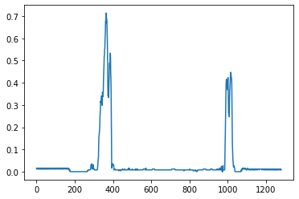

# Advanced Lane Finding Project Report

## Camera Calibration
The purpose of the camera calibration is to reduce the distortion of the images created by the cameras. For this we have
 created a class:

    utilities.calibration.CameraCalibration

The purpose of the class is to:

- Obtain the 3D points called *object points* and 2D points called *image points* using the method calibrate_camera(),
 the method receive a path parameter that contains the images 
necessary for the calibration

- It is also possible to serialize object and image points into a file,
 so this steps does not have to be executed every time.

- The camera calibration class also provides a method that allows to undistort an image and return the camera matrix,
 and distortion coefficients, required for further calls to the undistort method of opencv

The calibrate_camera calculates the object and image points on the chessboards,
 finds the corners and draw them on the images. These points are calculated for each image and stored.
  The output can be seen by passing True to the second parameter, an output folder prepend by 'output_' must exist. 

### Original image


### Undistort image


## Pipeline (single images)

### Distortion-corrected image.

For this step the camera correction points calculated and persisted before are used.
 After loading the points the image is undistorted by using the *undistort_image* method
  from *utilities.calibration.CameraCalibration* class is used.


### Thresholded binary image

A combination of color and gradient thresholds to generate a binary image
 (thresholding steps at lines 39 through 58 in `utilities.thresholds.py`), was used to  find the lanes.
 
- First the image is converted to the hls color space, and the s_channel is selected. 
- The threshold on the x axis, the magnitude and directions are calculated to be combined,
 and highlight the lanes on the road.  

The result can be seen here:


On the [jupyter notebook](tests/test_threshold.ipynb) can seen the different results for the test images.


### Perspective transform
The code to warp the image can be found on the `utilities.image_utility.py` file, line 27. The hardcode points divide 
the x axis in two, and provide a threshold where the lanes can be found. For the y axis a fix number is used,
 and a margin is selected to remove the hood of the car. 
 


I chose the hardcode the source and destination points in the following manner:

```python
half = image.shape[1] // 2
    src = np.float32([
    [half - width, y],
    [half + width, y],
    [image.shape[1] - border, image.shape[0] - border],
    [border, image.shape[0] - border]])
dst = np.float32([
    [0, 0],
    [image.shape[1], 0],
    [image.shape[1], image.shape[0]],
    [0, image.shape[0]]])
```
However using the recommended values also provide a good result:
```python
src = np.float32(
    [[(img_size[0] / 2) - 55, img_size[1] / 2 + 100],
    [((img_size[0] / 6) - 10), img_size[1]],
    [(img_size[0] * 5 / 6) + 60, img_size[1]],
    [(img_size[0] / 2 + 55), img_size[1] / 2 + 100]])
dst = np.float32(
    [[(img_size[0] / 4), 0],
    [(img_size[0] / 4), img_size[1]],
    [(img_size[0] * 3 / 4), img_size[1]],
    [(img_size[0] * 3 / 4), 0]])
```
The [jupyter notebook](tests/test_warp_image.ipynb) shows the results for all the test images.

### Lane identification
The code for the lane identification can be found in the [utilities.lane_finder.Lanes](utilities/lane_finder.py) class.

To identify the lanes, first the histogram is calculated.


 
Then calling the fit_polynomial, the sliding windows algorithm will be used to identify the complete line.


To make it faster it is also possible to search where the line was found before using the `search_around_poly()` method.


 
### Lane-line pixels
The lane vectors can be found using the `generate_plotting_values()` method.

.

### Curvature calculation  
On the [image utility](utilities/image_utility.py) there are two methods, one to find the curvature in pixels,
 and another in meters. `image_utility.measure_curvature_pixels`, `image_utility.measure_curvature_real`. 
 The methods calculate the curvature using the polynomial functions

#### 6. Provide an example image of your result plotted back down onto the road such that the lane area is identified clearly.

I implemented this step in lines # through # in my code in `yet_another_file.py` in the function `map_lane()`.  Here is an example of my result on a test image:

![alt text][image6]

---

### Pipeline (video)

#### 1. Provide a link to your final video output.  Your pipeline should perform reasonably well on the entire project video (wobbly lines are ok but no catastrophic failures that would cause the car to drive off the road!).

Here's a [link to my video result](./project_video.mp4)

---

### Discussion

#### 1. Briefly discuss any problems / issues you faced in your implementation of this project.  Where will your pipeline likely fail?  What could you do to make it more robust?

Here I'll talk about the approach I took, what techniques I used, what worked and why, where the pipeline might fail and how I might improve it if I were going to pursue this project further.  